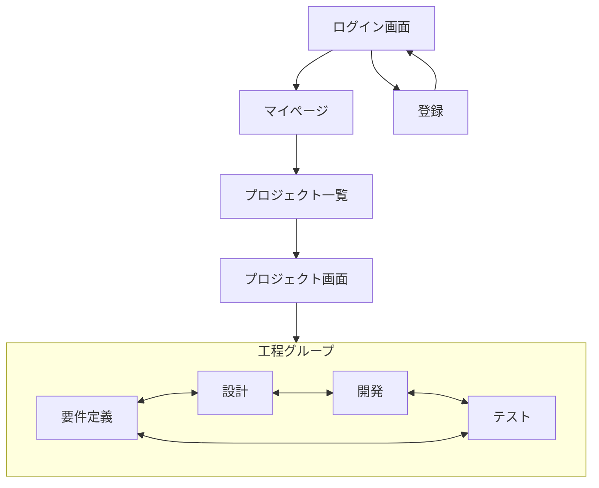

```mermaid
flowchart TB
  node_1["ログイン画面"]
  node_2["マイページ"]
  node_3["登録"]
  node_4["プロジェクト画面"]
  node_9["プロジェクト一覧"]


  %% 他のノードとの接続
  node_1 --> node_2
  node_1 --> node_3
  node_3 --> node_1
  node_2 --> node_9
  node_9 --> node_4
  node_4 --> group_1

  %% 大枠: 各工程をグループ化
  subgraph group_1 ["工程グループ"]
    node_5["要件定義"]
    node_6["設計"]
    node_7["開発"]
    node_8["テスト"]

    %% グループ内の自由な遷移
    node_5 <--> node_6
    node_6 <--> node_7
    node_7 <--> node_8
    node_8 <--> node_5
    
  end


```